# Smart Convenience Store

**AI 추천 기반의 스마트 편의점 애플리케이션**

사용자의 취향과 상황에 맞춰 상품을 추천하고, 간편하게 주문 및 리뷰까지 가능한 Android 기반의 스마트 편의점 앱입니다.  
Google Maps 연동, 출석 포인트 적립, GPT 기반 상품 추천 기능이 포함되어 있습니다.

---

## 📱 주요 기능

| 기능 | 설명 |
|------|------|
| 🔍 상품 검색 / 찜하기 | 키워드 기반 상품 검색, 카테고리 히스토리, 찜 등록 |
| 🧠 GPT 추천 | GPT API를 활용한 음식/상황 기반 상품 추천 |
| 🛍 장바구니 | 원하는 상품을 담고 한 번에 주문 |
| 📦 주문 내역 | 지난 주문 내역과 상세 정보 확인 가능 |
| ✍ 리뷰 기능 | 주문한 상품에 대한 리뷰 작성 및 확인 |
| ✅ 출석 체크 | 하루 한 번 출석 시 포인트 적립 |
| 🗺 지도 연동 | Google Maps를 통해 주변 편의점 위치 확인 |

---

## 🧩 사용 기술

- **Android** (Kotlin, Jetpack, ViewBinding)
- **Spring Boot** (Backend API)
- **MySQL** (DB)
- **OpenAI GPT API** (추천 기능)
- **Google Maps API**

--- 

## 📸 전체 앱 스크린샷

🏠 홈

 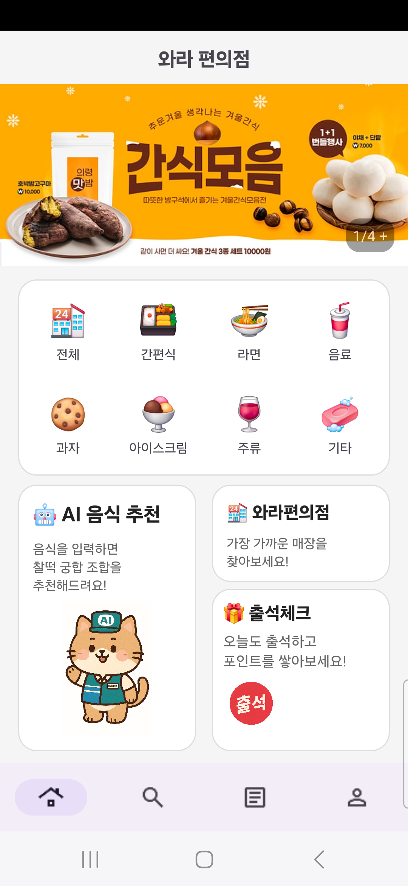 

⭐ 검색 / 상품추가 / 찜

 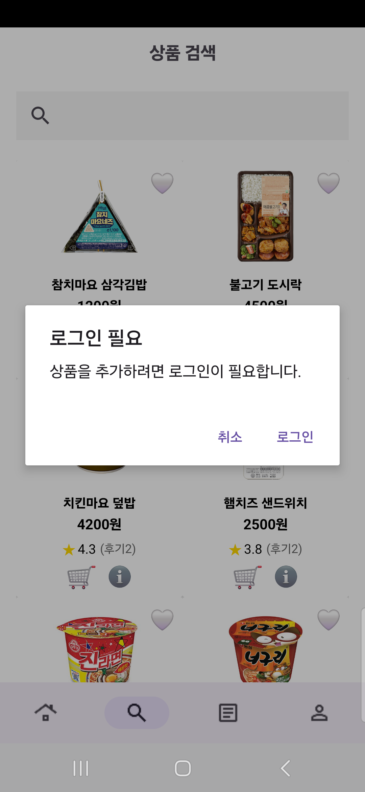 &nbsp;&nbsp; 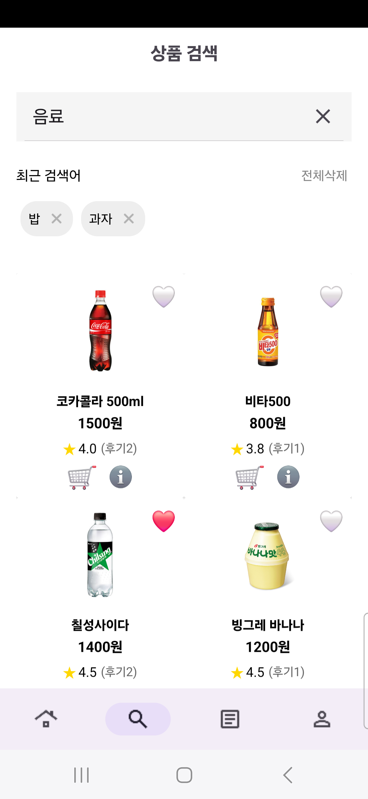 &nbsp;&nbsp; 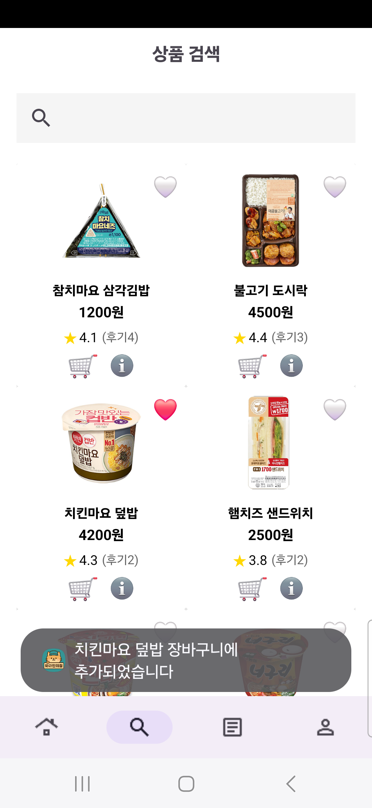 &nbsp;&nbsp; 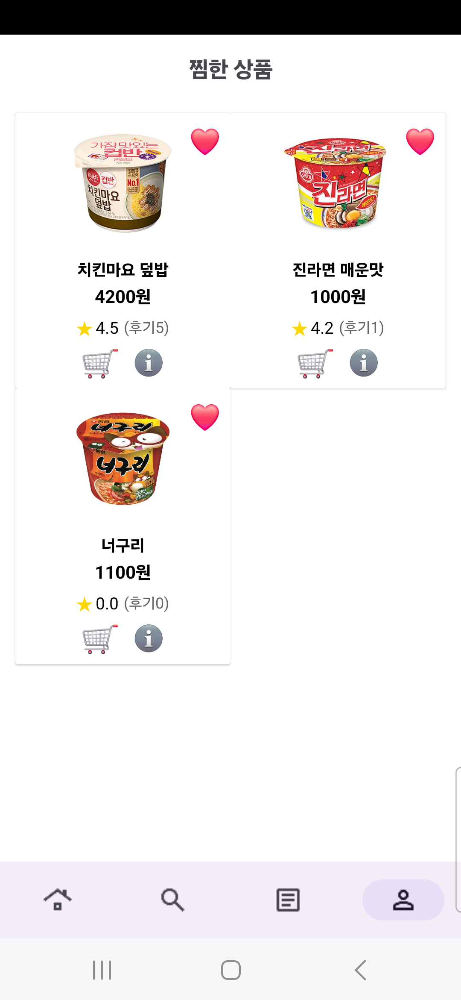 
  

🧠 AI 추천

 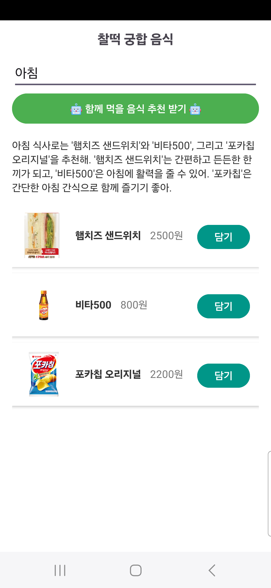 &nbsp;&nbsp;&nbsp; 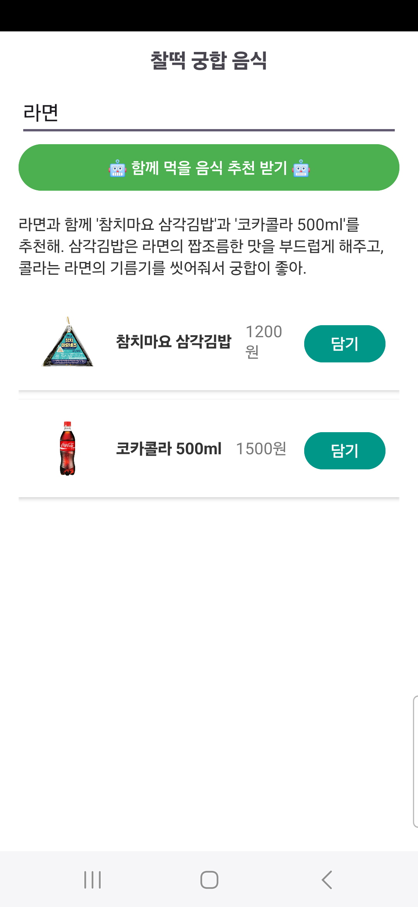 

🛒 장바구니 / 주문내역

 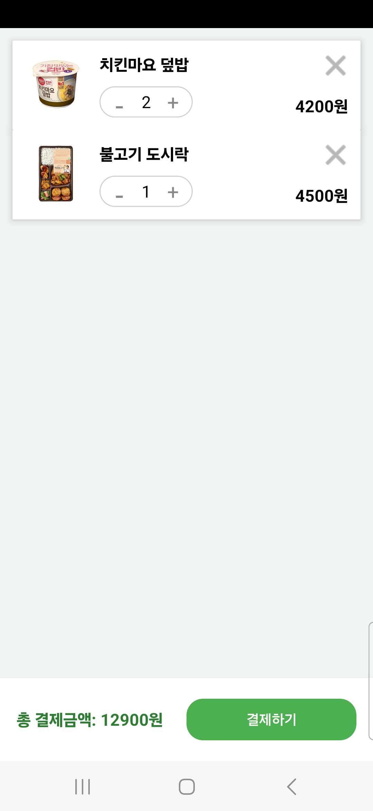 &nbsp;&nbsp;&nbsp; 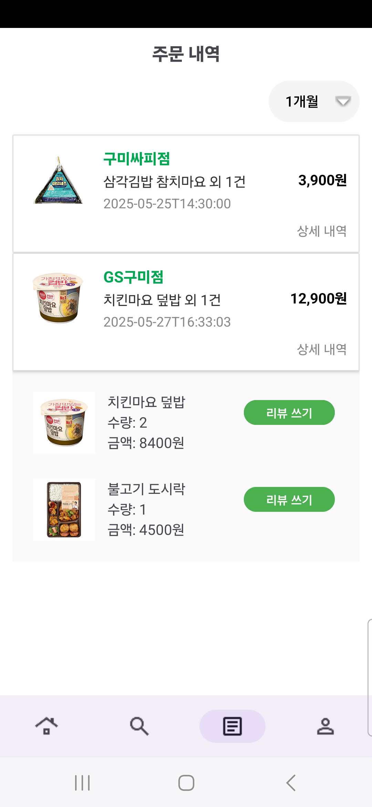 &nbsp;&nbsp;&nbsp; 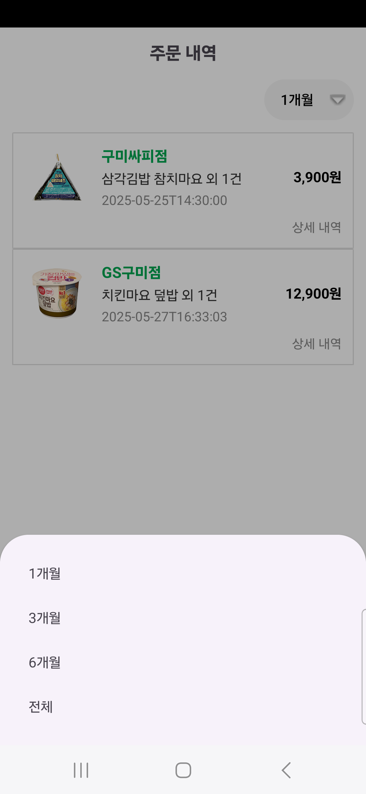 

📝 리뷰

 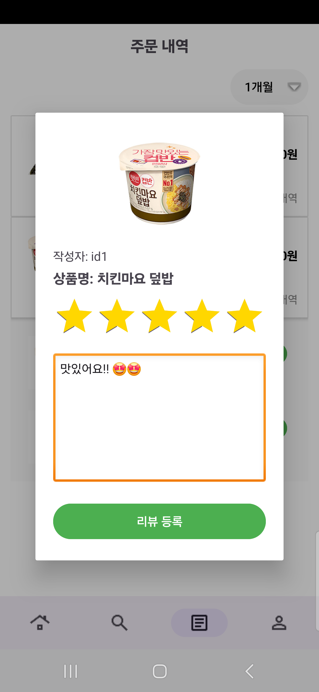 &nbsp;&nbsp;&nbsp; 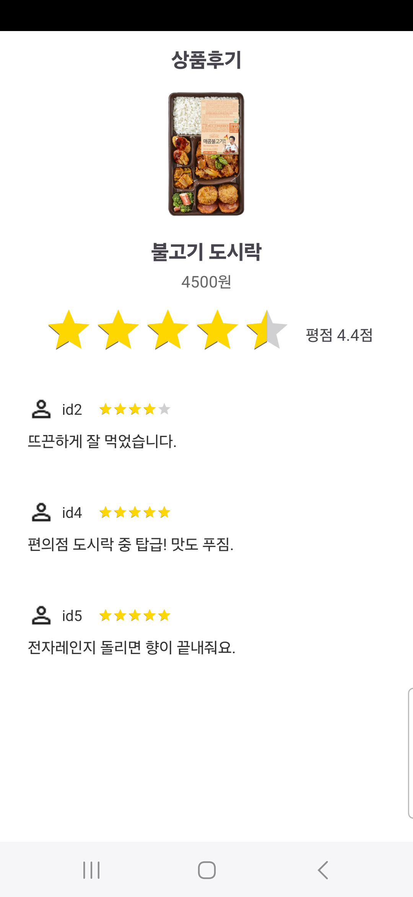 &nbsp;&nbsp;&nbsp; 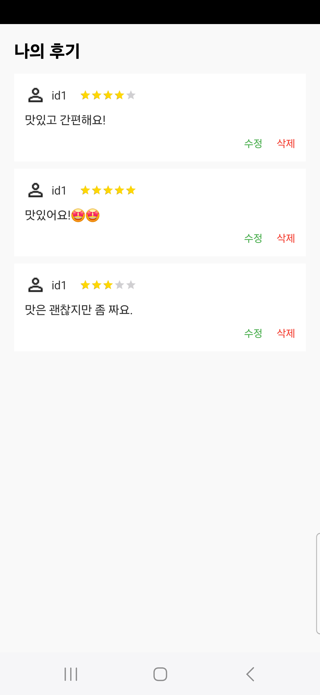 

👤 마이페이지 / 로그인 / 회원가입

 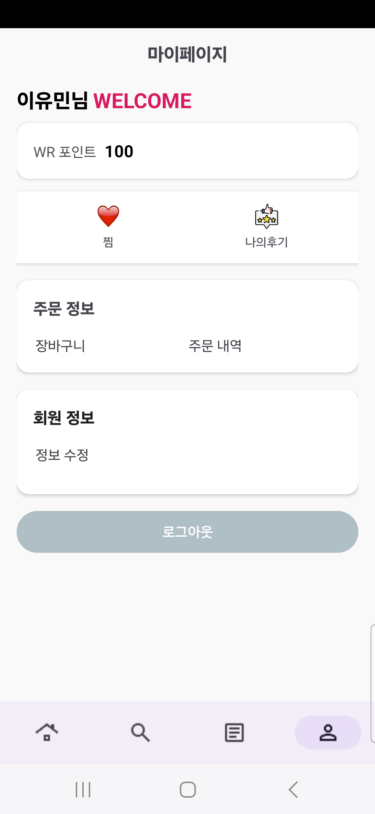 &nbsp;&nbsp;&nbsp; 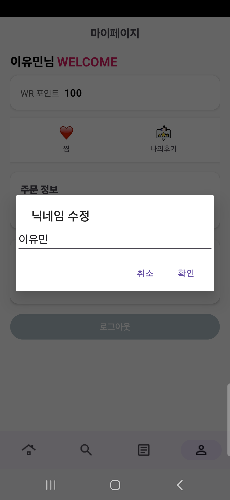 &nbsp;&nbsp; 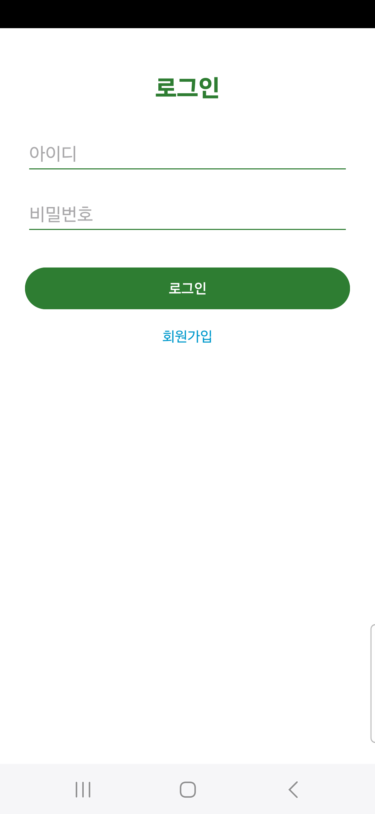 &nbsp;&nbsp; 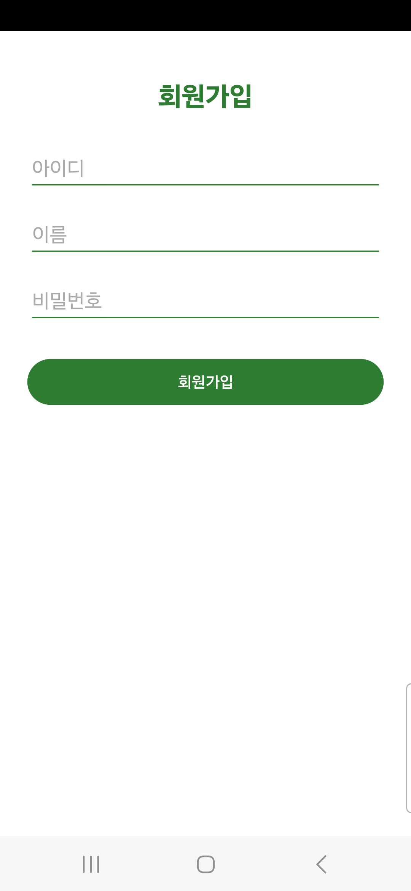 

🏠 지도

 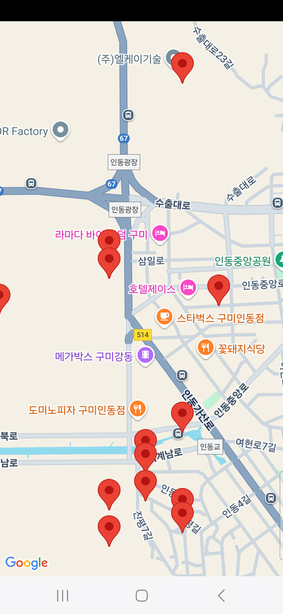 

